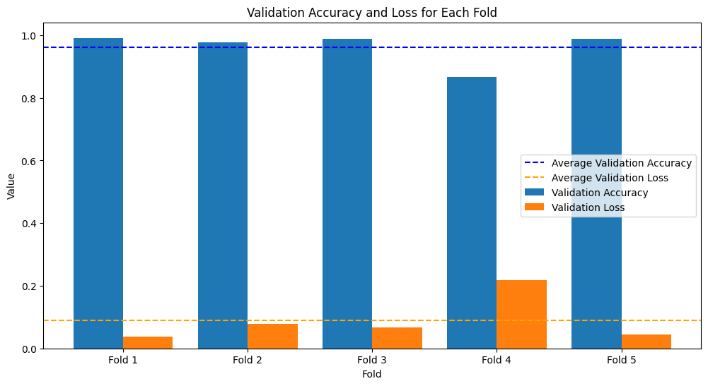

16. ResNet50, ResNet101, DenseNet Models:*  
(>93%).  
  
15. *CNN and Bidirectional LSTM Network:*  
98.43%/99.69%.  
  
  
  
1. *Multi-channeled Deep Convolutional Neural Network (DCNN) for COVID-19 Diagnosis:*  
95.45%

https://www.kaggle.com/datasets/vbookshelf/respiratory-sound-database

Experiments

We used OneHotEncoder from sklearn inteand to_catorical from keras.It can convet string to one hot encoding.While using to_categorical we have to convert the string to integer first.

Then we apply encoding of test and train data seperately, to avoid data leakage.
But this reduce the accuracey to 96% fro 99%.

while using k_folds on the rdm model it give average accuracey of 93% 3 fold give above 95% but 2 give below 99% issue is unknown.

Increase the number of k_fold  to 10 and used all the data without holding test set gives very wierd results. It gives 100% accuracey on 1 fold and alos giving below 50% for 1 on other fold. This is very strange.

Fold 1 - Validation accuracy: 1.0, Validation loss: 0.0006286638090386987
Fold 2 - Validation accuracy: 0.9785605072975159, Validation loss: 0.07120388001203537
Fold 3 - Validation accuracy: 0.9142419695854187, Validation loss: 0.17263072729110718
Fold 4 - Validation accuracy: 0.6140888333320618, Validation loss: 1.460251808166504
Fold 5 - Validation accuracy: 0.8665643930435181, Validation loss: 0.279648095369339
Fold 6 - Validation accuracy: 0.46165645122528076, Validation loss: 4.546066761016846
Fold 7 - Validation accuracy: 0.9386503100395203, Validation loss: 0.2970259487628937
Fold 8 - Validation accuracy: 0.8588957190513611, Validation loss: 0.22009585797786713
Fold 9 - Validation accuracy: 0.6610429286956787, Validation loss: 0.9196524620056152
Fold 10 - Validation accuracy: 0.9693251252174377, Validation loss: 0.27248454093933105
Average validation accuracy: 0.8263026237487793
Average validation loss: 0.8239688745350577

Fold 1 - Loss: 0.03805924952030182, Accuracy: 0.9913793206214905
Fold 2 - Loss: 0.07804062217473984, Accuracy: 0.9779693484306335
Fold 3 - Loss: 0.06737184524536133, Accuracy: 0.9885057210922241
Fold 4 - Loss: 0.21783651411533356, Accuracy: 0.8659003973007202
Fold 5 - Loss: 0.043500036001205444, Accuracy: 0.9884947538375854
Average validation accuracy: 0.0889616534113884
Average validation loss: 0.9624499082565308

